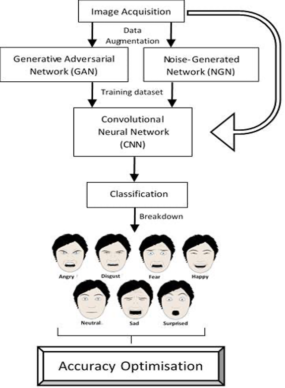

<!-- omit in toc -->
# ​Improving Deep Learning Accuracy by Data Augmentation Using Generative Adversarial Networks (GAN)

<!-- omit in toc -->
## Table of contents

- [About the project](#about-the-project)
- [Project summary](#project-summary)
- [Method](#method)
- [Results](#results)
  - [ResNet101](#resnet101)
  - [EfficientNet-B2](#efficientnet-b2)
  - [VGG-19](#vgg-19)
- [Getting started](#getting-started)
  - [Installation](#installation)
  - [Required files](#required-files)
  - [Folder structure](#folder-structure)
- [Usage](#usage)
  - [Training GAN](#training-gan)
  - [Generating images from GAN weights](#generating-images-from-gan-weights)
  - [Training classifier](#training-classifier)
  - [Testing classifier](#testing-classifier)
- [Acknowledgments](#acknowledgments)

## About the project

​Improving Deep Learning Accuracy by Data Augmentation Using Generative Adversarial Networks (GAN) is a project for the NTU module EE3080 Design & Innovation Project. 

We won second place in the NTU EEE DIP competition within the Thematic Programme. 

By [Tan Kim Wai](https://github.com/ktan119), [Ng Woon Ting Elizabeth](https://github.com/elizabethhng), [Melvin Kok Xinwei](https://github.com/melvinkokxw), Lee Huei Min, Teo Jing Yu, Matthew Stanley, Carina Low Su Yun and Tian Siming.

## Project summary

The aim of the project was to find out if data augmentation using GANs could improve deep learning accuracy, specifically classification accuracy. The improvement in performance is measured by comparing the accuracy of models trained on augmented datasets to that of models trained on a baseline dataset. As a comparison to the current predominant data augmentation methods, we also used the accuracies of models trained on noise-augmented datasets as an additional reference. 

Our project goals were achieved as the results collated showed an improvement of up to **4.7%** in classification accuracy.. However, it is also of note that data augmentation using GANs did not significantly outperform data augmentation using noise. When a state-of-the-art classification model like VGG19 is used, the accuracy was only improved marginally over the baseline accuracy. 

## Method

Using the [Facial Expression Recognition (FER2013)]() dataset from Kaggle as our baseline dataset, we performed classification using three different CNN models, namely **VGG19**, **ResNet101**, and **EfficientNet-B2**. This initial set of test classification accuracies served as our baseline accuracy.

We then generated images using two methods:
* GAN models (ESRGAN & WGAN-GP)
* Adding noise to images (Gaussian, Laplace and Poisson noise)

We combined the generated images with the baseline dataset to create multiple augmented datasets. These datasets were then used to train the abovementioned CNN models and the test classification accuracies were then compared to the baseline accuracy.

<p align="center">
  
</p>

We further improved the outputs of the GAN generated images by using two methods:
* Feeding enhanced resolution images from ESRGAN into WGAN-GP (instead of the normal resolution images)
* Using face detection to improve the output of WGAN-GP

## Results

### ResNet101

| Dataset | Validation Accuracy | Test Accuracy |
|-----------------|---------------------|---------------|
| Original | 63.42% | 64.36% |
| Noise | 65.98% | 69.10% (+4.74) |
| WGAN-GP | 65.61% | 66.87% (+2.51) |
| ESRGAN | 63.89% | 66.01% (+1.65) |
| ESRGAN + WGAN-GP | 66.12% | 68.32% (+3.96) |
| ESRGAN + WGAN-GP + Face Detection | 67.43% | 68.79% (+4.43) |

### EfficientNet-B2

| Dataset | Validation Accuracy | Test Accuracy |
|-----------------|---------------------|---------------|
| Original | 63.75% | 62.25% |
| Noise | 65.09% | 67.54% (+5.29) |
| WGAN-GP | 65.67% | 66.59% (+4.34) |
| ESRGAN | 63.89% | 64.25% (+2.00) |
| ESRGAN + WGAN-GP | 64.17% | 64.47% (+2.22) |
| ESRGAN + WGAN-GP + Face Detection | 65.95% | 66.90% (+4.65) |

### VGG-19

| Dataset | Validation Accuracy | Test Accuracy |
|-----------------|---------------------|---------------|
| Original | 67.71% | 68.29% |
| Noise | 66.95% | 67.67% (-0.62) |
| WGAN-GP | 66.20% | 68.85% (+0.56) |
| ESRGAN | 66.04% | 67.34% (-0.95) |
| ESRGAN + WGAN-GP | 65.62% | 67.04% (+1.25) |
| ESRGAN + WGAN-GP + Face Detection | 66.59% | 68.68% (+0.39) |

## Getting started

### Installation

1. Clone the repo

```bash
git clone https://github.com/melvinkokxw/improving-dl-accuracy-gan
cd improving-dl-accuracy-gan
```
2. Install required packages

The following packages are required:
- `torch`
- `torchvision`
- `Pillow`
- `numpy`
- `pandas`
- `pytorchcv`
- `opencv-python`
- `tqdm`
- `matplotlib`
- `imgaug`

Install via pip:

```bash
python3 -m pip install <package-name>
```

### Required files

The following files are required to run the program:

* Image
* Haar Cascade file. The Haar cascade file is required to run face detection can be obtained from [here](https://github.com/opencv/opencv/tree/master/data/haarcascades). Once downloaded, place into the `weights` folder 
* ESRGAN weights file. Get download link from [here](https://github.com/xinntao/ESRGAN#test-models).

### Folder structure

As a guideline, here is where to put the weights & data

```
.
├── README.md
├── classifier
├── models
├── data
│   ├── baseline
│   │   ├── test
│   │   ├── train
│   │   └── val
│   ├── esrgan
│   │   ├── test
│   │   ├── train
│   │   └── val
│   └── {wgan_gp, esrgan_wgan_gp, esrgan_wgan_gp_fd}
│       ├── 0
│       ├── ...
│       └── 6
└── weights
    ├── esrgan
    │   ├── README.md
    │   ├── RRDB_ESRGAN_x4.pth
    ├── {vgg19, resnet101, efficientnet-b2b}                                   <-- Classifier weights go here
    │   ├── {baseline, wgan_gp, esrgan, esrgan_wgan_gp, esrgan_wgan_gp_fd}
    │   │   ├── weights_1.pth
    │   │   ├── weights_2.pth
    │   │   └── weights_3.pth
    ├── {baseline, wgan_gp, esrgan, esrgan_wgan_gp, esrgan_wgan_gp_fd}         <-- GAN weights go here
        ├── 0
        │   └── weights.pth
        ├── ...
        └── 6
            └── weights.pth
```

## Usage

### Training GAN

1. Place image folders into `data/`, as specified in the [folder structure](#folder-structure)
   
2. Run the training file

```bash
python3 models/wgan_gp/train.py [-h] [--n_epochs N_EPOCHS] [--batch_size BATCH_SIZE] [--lr LR]
                                [--b1 B1] [--b2 B2] [--n_cpu N_CPU] [--latent_dim LATENT_DIM]
                                [--img_size IMG_SIZE] [--channels CHANNELS]
                                [--n_critic N_CRITIC] [--clip_value CLIP_VALUE]
                                [--sample_interval SAMPLE_INTERVAL]
                                [--dataset {baseline,esrgan}]
```

### Generating images from GAN weights

1. Place weights into respective folders in `weights/`, as specified in the [folder structure](#folder-structure)

2. Run the relevant generator file

For ESRGAN:

```bash
python3 models/esrgan/generate.py
```

For WGAN-GP & its variants:

```bash
python3 models/wgan_gp/generate.py [-h] [--quality {baseline, esrgan}] [--face_detection]
```

### Training classifier

1. Place image folders into `data/`, as specified in the [folder structure](#folder-structure)

2. Run the classifier training file

```bash
python3 classifier/train.py [-h] [--dataset {baseline,esrgan,wgan_gp,esrgan_wgan_gp,esrgan_wgan_gp_fd}]
                            [--classifier {vgg19,resnet101,efficientnet-b2b}]
```

1. Weights will be saved into `weights/<classifier>/<dataset>`, while training graphs will be saved into `classifier/graphs`

### Testing classifier

1. Place weights into respective folders in `weights/`, as specified in the [folder structure](#folder-structure)

2. Run the classifier testing file

``` bash
python3 classifier/test.py [-h]
                           [--dataset {baseline,esrgan,wgan_gp,esrgan_wgan_gp,esrgan_wgan_gp_fd}]
                           [--classifier {vgg19,resnet101,efficientnet-b2b}]
```

3. The highest accuracy and corresponding weight file will be printed to `stdout`

## Acknowledgments

* WGAN-GP model adapted from [PyTorch-GAN](https://github.com/eriklindernoren/PyTorch-GAN)
* ESRGAN model adapted from [ESRGAN](https://github.com/xinntao/ESRGAN)